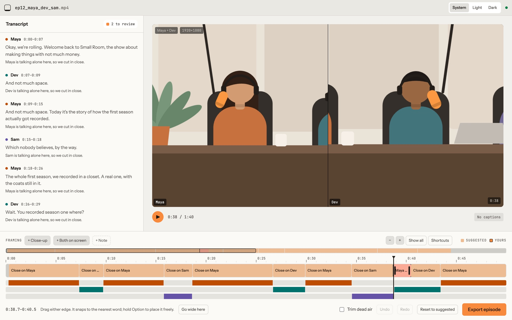
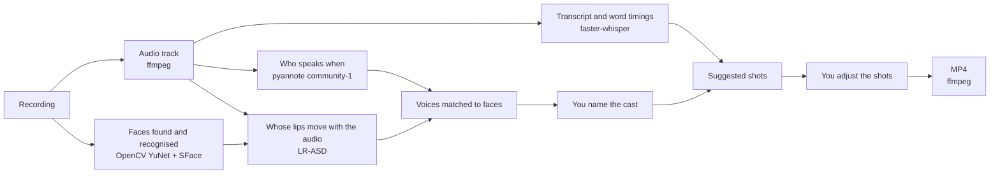

<div align="center">

# Cutroom

**Podcast video that cuts itself.**

Free, open source, and it runs on your own computer. Drop in a one-camera
recording of two, three or four people. Cutroom writes the transcript, works
out who's speaking, and cuts in close on them. Then it hands you every
decision to change.

[Website](https://cutroom-ruddy.vercel.app) · [Join the waitlist](https://cutroom-ruddy.vercel.app/#waitlist) ·
[Quick start](#quick-start) · [Contributing](CONTRIBUTING.md) · [Docs](docs/README.md)

[](https://github.com/jain-eshan/cutroom/actions/workflows/ci.yml)

[](LICENSE)

</div>



## Contents

- [Why it exists](#why-it-exists)
- [What works today](#what-works-today)
- [Download](#download)
- [Quick start](#quick-start)
- [Using it, step by step](#using-it-step-by-step)
- [Keyboard shortcuts](#keyboard-shortcuts)
- [Troubleshooting](#troubleshooting)
- [How it works](#how-it-works)
- [Project layout](#project-layout)
- [Development](#development)
- [Contributing](#contributing)
- [Credits](#credits)
- [Licence](#licence)

## Why it exists

Tools that edit podcast video automatically assume a studio: a microphone and
a camera for every person, so the software can tell who's talking by checking
which track is loud. Most shows don't have that. A camera on a table, a phone,
or a Zoom call gives you one picture and one mixed audio track, and someone
ends up cutting it by hand.

Cutroom works out who's talking from the recording itself: whose voice it is,
and whose lips are moving. Everything runs locally. Your recording is never
uploaded anywhere, and there's no account, subscription or server.

## What works today

Cutroom is a **developer preview**: the whole path from recording to edited
video works, and has been run on real multi-person episodes, but it has
rough edges and its packaged installer is untested outside this repo.

**Works**

- Transcription with a timing for every word, and speaker detection on a
  single mixed track, including when people talk over each other
- Finding and recognising each person's face across the whole episode
- Matching each voice to a face by lip movement, with uncertain matches
  flagged for you to confirm
- An editor with the transcript, a live preview that matches the export, and
  a framing timeline you can zoom, scrub, drag, snap and undo
- Export to MP4 at the source resolution, with the audio copied through
  untouched, optional burned-in captions, and optional trimming of long
  pauses and filler words
- Keep your work if you close the browser tab: a job keeps processing in the
  background and reopens from the upload screen's recent-episodes list
  without reprocessing (in-progress edits and cast confirmations aren't
  saved yet, so reopening skips back to the Cast screen)

**Doesn't yet**

- Ship a signed Mac installer or a Windows build anyone's tried running (the
  desktop app and its installer pipeline exist -- see
  [Download](#download) -- but neither has had real-world use yet)
- Stay on the main speaker through a quick "yeah" or "right". The rules for
  this are written up in [docs/EDGE_CASES.md](docs/EDGE_CASES.md), but not
  built
- Reliably tell four people apart on a long episode
- Run the actual processing pipeline on Windows or Linux (untested; help
  wanted)

The ordered roadmap is in [docs/STATUS.md](docs/STATUS.md).

## Download

Mac and Windows builds are on the
[Releases page](https://github.com/jain-eshan/cutroom/releases) -- no
terminal, no cloning the repo, and nothing to install separately: ffmpeg
ships inside the app, and it installs `uv` itself on first launch.

These builds are new and haven't been tried outside this repo yet -- if
something breaks, [open an issue](https://github.com/jain-eshan/cutroom/issues).
The Mac build isn't code-signed, so Gatekeeper will block it on first open;
right-click the app and choose Open to run it anyway. If you'd rather run
from source, or you're on Linux, see Quick start below.

## Quick start

### What you need

| | Why | How to get it |
|---|---|---|
| **macOS on Apple silicon** | The only setup tested so far | |
| **Node.js 22.18 or newer** | Runs the app and its tooling | `brew install node`, or [nodejs.org](https://nodejs.org) |
| **uv** | Installs and runs the processing service, including Python 3.12 | `brew install uv`, or [docs.astral.sh/uv](https://docs.astral.sh/uv/) |
| **ffmpeg** | Reads recordings and renders the export | `brew install ffmpeg` |
| **A Hugging Face account** | The speaker detection model needs a free token | [huggingface.co/join](https://huggingface.co/join) |
| **About 3 GB of disk** | Python packages and models | |
| **8 GB of memory or more** | A 53-minute episode peaked at 4.5 GB while processing | |

### Install and run

```bash
git clone https://github.com/jain-eshan/cutroom.git
cd cutroom
npm install
npm run dev
```

Then open **http://localhost:3460**.

`npm run dev` starts the app and the local processing service together, and
stops both when you press Ctrl+C. There's no second terminal to manage.

## Using it, step by step

### 1. The setup screen

The first start installs the processing service's Python packages, which takes
a few minutes. The setup screen shows it working and moves on by itself.

Then it asks you to connect Hugging Face, once:

1. Create a **Read** token at
   [huggingface.co/settings/tokens](https://huggingface.co/settings/tokens).
2. Accept the licence for
   [pyannote/speaker-diarization-community-1](https://huggingface.co/pyannote/speaker-diarization-community-1)
   with the same account.
3. Paste the token into the setup screen and press Save.

The app checks the token and the licence with Hugging Face, then saves it to
`server/.env` on your machine with owner-only permissions. You don't need to
restart anything. (Writing `HF_TOKEN=...` into `server/.env` yourself also
works.)

### 2. Drop in a recording

Drag a video file onto the page. Any single-camera recording ffmpeg can read
will do: a camera file, a phone video, a Zoom recording.

The first recording also downloads the models, about 600 MB in total (the
Whisper transcription model is most of it).

Processing takes roughly a quarter to a third of the recording's length on an
Apple silicon Mac: a 53-minute, four-person episode took 15 minutes. The
screen shows each stage, the transcript as it's written, and the faces as
they're found. **Keep the tab open** until it finishes; closing it loses the
progress.

### 3. Name the cast

Cutroom shows each voice it heard, with its best guess at whose face it
belongs to. Name each person and confirm or fix the match. Guesses it isn't
sure about are marked. A voice that never appears on camera can be named too.

### 4. Edit

The editor has three parts:

- **Transcript** (left): every line with the speaker's name and a one-line
  reason for the shot chosen there. Click a line to jump to it. Lines where
  people talk over each other, or where no face was found, are flagged.
- **Preview** (right): plays the edit exactly as it will export.
- **Framing timeline** (bottom): the shots. Close-ups, both-on-screen shots,
  and wide wherever there's no shot. Pick a shot to drag either edge, add a
  close-up or a both-on-screen shot at the current line, make a shot wide, or
  reset to the suggestions. Edges snap to words; hold Option to place them
  freely.

### 5. Export

Press **Export episode**. The publish screen lets you turn on burned-in
captions (see below) and trimming of long pauses and filler words, then
renders the MP4. Rendering a long episode takes a while and doesn't show
progress yet. When it's done, save the file.

### Captions (optional)

Burned-in captions need an ffmpeg built with libass. Homebrew's regular
`ffmpeg` doesn't include it; `ffmpeg-full` does, and it installs alongside
your existing ffmpeg without replacing it:

```bash
brew install ffmpeg-full
```

Then add this line to `server/.env`:

```
FFMPEG_BINARY=/opt/homebrew/opt/ffmpeg-full/bin/ffmpeg
```

and restart `npm run dev`. Without it, everything else works, and the publish
screen tells you captions aren't available instead of failing mid-render.

## Keyboard shortcuts

In the editor:

| Keys | Does |
|---|---|
| Space | Play or pause |
| K | Pause |
| L | Play; press again for 2× or 4× |
| J | Back 5 seconds |
| ← → | Back or forward 1 second (10 with Shift) |
| ↑ ↓ | Previous or next shot |
| = − | Zoom the timeline in or out (or pinch, or ⌘-scroll) |
| Shift Z | Show the whole episode |
| ⌘Z, ⇧⌘Z | Undo, redo |
| Delete | Make the picked shot wide |
| Esc | Unpick the shot |

The **Shortcuts** button in the editor lists them too.

## Troubleshooting

**The setup screen says the service stopped or couldn't start.**
It shows the last lines of the service's log. The usual causes are `uv` not
being installed (`uv --version` to check) or a failed package install on a
flaky connection. Fix the cause and press **Try again**.

**Something else is using port 3460.**
Vite quietly moves the app to the next free port, but the processing service
only accepts requests from port 3460, so every request fails. Stop whatever is
on 3460 (`lsof -i :3460` shows it) and start again.

**Port 8787 is already in use.**
The app uses whatever is answering on 8787. If that's an old copy of the
processing service from a previous session, stop it, or it may be running
older code.

**"Hugging Face didn't accept that token."**
The token was mistyped or revoked. Create a new Read token and paste it again.

**"That token belongs to … but that account hasn't accepted the model's terms yet."**
Open the community-1 page linked in the message while signed in to that
account, accept the terms, and press Save again.

**"Could not reach the local processing service."**
The service stopped while the app was waiting for it. Check the terminal
running `npm run dev` for the error, and please
[open an issue](https://github.com/jain-eshan/cutroom/issues/new/choose) with
it.

**The first recording is very slow to start.**
It's downloading the models. Later recordings skip this.

**I closed the tab while it was processing.**
The progress is lost; start the recording again. Saving episodes is on the
roadmap.

**The edit cut to the wrong person, or cut too often.**
Fix it on the timeline, and if you can, tell us what happened with the
[The edit got it wrong](https://github.com/jain-eshan/cutroom/issues/new/choose)
form. Many known cases are listed in [docs/EDGE_CASES.md](docs/EDGE_CASES.md).

## How it works

Cutroom is two programs on your machine. The **app** is a React site running
in your browser. The **processing service** is a Python (FastAPI) program
listening only on `127.0.0.1:8787`. `npm run dev` starts both.



The shots are the heart of it. Each one covers a stretch of time and says who
is on screen: one person in close-up, or several side by side. Anywhere no
shot covers is the untouched wide frame. The preview in the app and the
renderer use the same rules, so what you approve is what you get.

For the full design, every dependency and why it's there, see
[docs/ARCHITECTURE.md](docs/ARCHITECTURE.md). For how speaker detection, face
tracking and lip-sync work in detail, see
[server/README.md](server/README.md).

## Project layout

```
src/            The app (React, TypeScript, Tailwind CSS, Vite)
server/         The processing service (Python 3.12, FastAPI, uv)
  pipeline/     One module per step: transcribe, diarize, faces, lipsync,
                fuse, framing, render, captions, trim
  tests/        pytest suite
site/           The website (a separate small Vite app)
docs/           Status, features, edge cases, architecture, design handoff
.github/        CI, issue forms and the pull request template
```

A fuller tour, file by file, is in [CONTRIBUTING.md](CONTRIBUTING.md).

## Development

| Command | Does |
|---|---|
| `npm run dev` | Starts the app and the processing service |
| `npm run site` | Starts the website on http://localhost:3461 |
| `npm test` | Frontend unit tests |
| `npx tsc -b` | Typechecks the app, the website and the configs |
| `npm run lint` | Lints with oxlint |
| `npm run build` | Builds the app |
| `npm run site:build` | Builds the website |
| `uv run --directory server pytest` | Processing service tests |

To run the processing service on its own, see
[server/README.md](server/README.md).

## Contributing

Help is very welcome, from code to reports of edits it got wrong. Start with
[CONTRIBUTING.md](CONTRIBUTING.md). Good first places to look:

- [docs/EDGE_CASES.md](docs/EDGE_CASES.md): the framing rules that need
  building, with a suggested order
- [docs/STATUS.md](docs/STATUS.md): the roadmap
- [docs/README.md](docs/README.md): a map of all the documentation

Security problems: please report them privately, as described in
[SECURITY.md](SECURITY.md).

## Credits

Cutroom is built on other people's open work:

- [faster-whisper](https://github.com/SYSTRAN/faster-whisper) (MIT), running
  OpenAI's [Whisper](https://github.com/openai/whisper) `small` model (MIT),
  for transcription
- [pyannote.audio](https://github.com/pyannote/pyannote-audio) (MIT) and the
  [pyannote/speaker-diarization-community-1](https://huggingface.co/pyannote/speaker-diarization-community-1)
  pipeline by pyannote, licensed
  [CC BY 4.0](https://creativecommons.org/licenses/by/4.0/), for speaker
  detection
- [OpenCV](https://opencv.org) (Apache 2.0), with the YuNet face detection and
  SFace face recognition models from
  [OpenCV Zoo](https://github.com/opencv/opencv_zoo) (see each model's
  licence there)
- [LR-ASD](https://github.com/Junhua-Liao/LR-ASD) (MIT) with its AVA-trained
  weights, for lip-sync
- [FFmpeg](https://ffmpeg.org) (LGPL/GPL), run as a separate program, for
  reading and rendering video
- [Instrument Sans](https://fonts.google.com/specimen/Instrument+Sans) and
  [JetBrains Mono](https://www.jetbrains.com/lp/mono/) (SIL Open Font
  Licence)

## Licence

[MIT](LICENSE).
